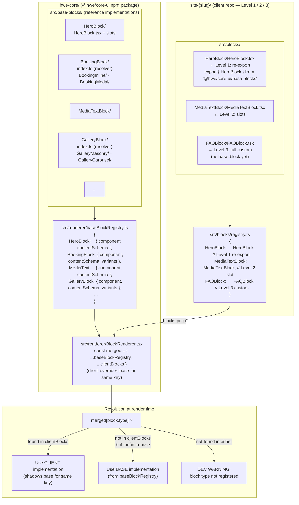

# Block resolution chain — base registry + client overrides

> How `BlockRenderer` resolves which component to render for a given block type: it merges the platform's `baseBlockRegistry` with the client's own registry, giving client blocks priority. Materialises [DEC-015](../architecture/decisions.md#dec-015--client-owned-blocks-with-shared-schemas-slot-based-composition-and-npm-subpath-exports) (client-owned blocks) and [DEC-017](../architecture/DEC-017-Repo-Split.md) (independent client repos).
>
> For how the winning component resolves its **variant** at render time, see [`block-variant-resolution.md`](./block-variant-resolution.md).

## The three usage levels

| Level | Where it lives | Pattern | Typical frequency |
|---|---|---|---|
| **Level 1 — re-export** | `src/blocks/{Name}/{Name}.tsx` | `export { HeroBlock } from '@hwe/core-ui/base-blocks'` | ~70% of blocks |
| **Level 2 — slots** | `src/blocks/{Name}/{Name}.tsx` | `<BaseName {...props} SlotName={MyComp} />` | ~20% |
| **Level 3 — full custom** | `src/blocks/{Name}/{Name}.tsx` | Own JSX, imports schema types only from `@hwe/core-ui/schemas` | ~10% |

## Key invariants

- **Client registry always wins** for keys it declares. A Level 1 re-export passes through transparently; a Level 3 full custom completely replaces the base block for that client.
- **Base-blocks stay in `hwe-core/`**. No per-client logic ever enters `@hwe/core-ui/src/base-blocks/`. Client-specific implementations live in `site-{slug}/src/blocks/` ([DEC-015](../architecture/decisions.md#dec-015--client-owned-blocks-with-shared-schemas-slot-based-composition-and-npm-subpath-exports), [DEC-017](../architecture/DEC-017-Repo-Split.md)).
- **Schemas are shared.** Even Level 3 blocks import their content type from `@hwe/core-ui/schemas` — content contracts are stable across the platform. Only the rendering is per-client.
- **BlockRenderer receives the final merged map.** The merge is `{ ...baseBlockRegistry, ...clientBlocks }` — one line, no magic. The renderer doesn't know or care which level a block is.
