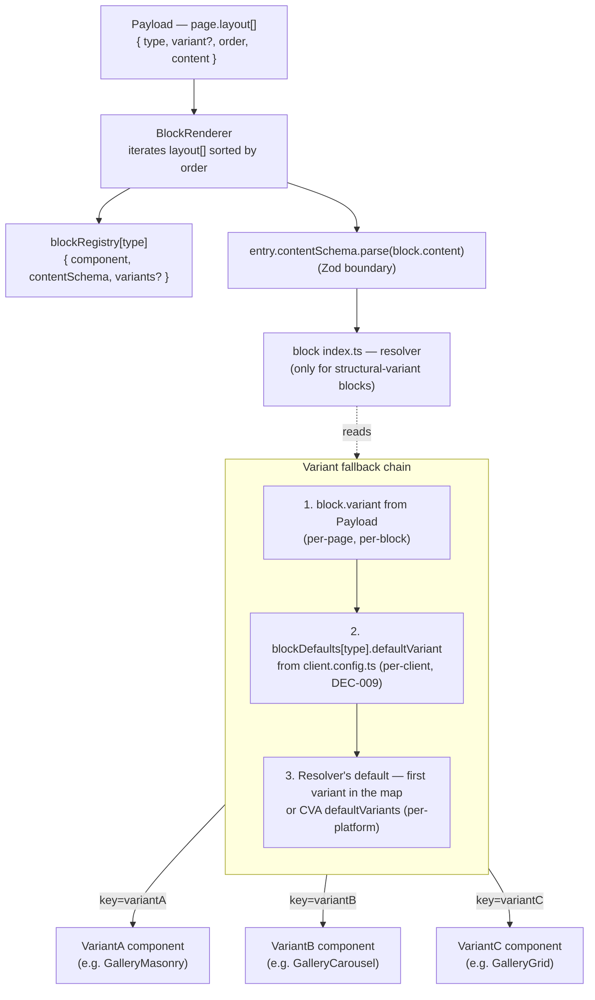

# Block variant resolution

> How a block's effective variant is resolved at render time, from Payload `layout[]` down to the structural-variant component that actually renders. Visualises the fallback chain introduced by [DEC-008](../architecture/decisions.md#dec-008--structural-variants-for-complex-blocks) and [DEC-009](../architecture/decisions.md#dec-009--remove-activeblocks-add-blockdefaults-to-clientconfigts).

## Resolution walkthrough

For a `GalleryBlock` rendered on a page where the editor selected `variant: "masonry"`:

1. **Payload** stores `{ type: 'GalleryBlock', variant: 'masonry', order: 2, content: {...} }`.
2. **`BlockRenderer`** sorts `layout[]` by `order`, looks up `blockRegistry['GalleryBlock']`, parses `content` with the registered Zod schema, and renders `entry.component` passing `content` and `variant`.
3. **`entry.component`** is the resolver exported by `blocks/GalleryBlock/index.ts`. It checks `variant`:
   - If `'masonry'` is a key in `galleryVariants` → renders `GalleryMasonry`.
   - If the variant is unset, the resolver falls back through the chain (Payload → `blockDefaults` → resolver default).
4. **`GalleryMasonry`** receives `content` and renders. It may still use CVA internally for fine-grained styling.

## Why a fallback chain instead of a single source

- **Payload (per-page)** lets the content editor override per-instance.
- **`blockDefaults` (per-client)** lets onboarding declare "this client prefers masonry over carousel" once, instead of repeating it on every page.
- **Resolver default (per-platform)** ensures a block always renders something sane even when Payload data is incomplete or `blockDefaults` is absent.

The chain is materialised by `BlockRenderer` and composition code that reads `useTenant().blockDefaults`. The resolver inside the block only receives a final `variant` prop — it does not know about steps 1 and 2.

## CVA-only blocks

A block that has CVA variants (styling only) **does not need a resolver**. Its `{Name}.tsx` reads the variant prop and passes it to `cva()`. The registry can still declare `variants: ['light', 'dark']` for Payload schema generation, but there is no `index.ts` and no subfolder layout. Structural variants are an opt-in extension.
