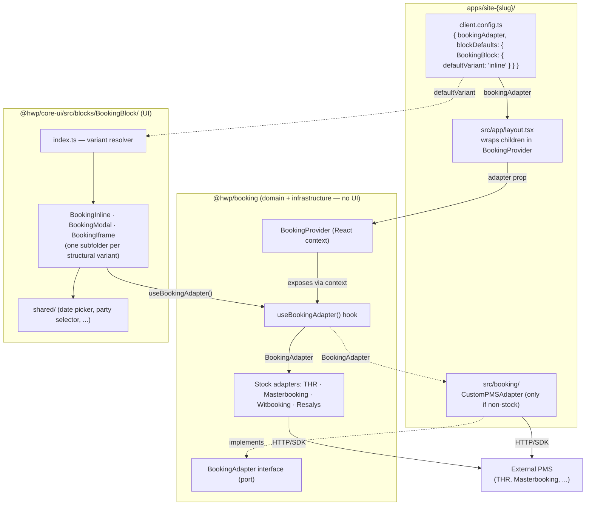

# Booking architecture — `BookingBlock` and `BookingAdapter`

> How the booking UI in `@hwp/core-ui` consumes a PMS adapter from `@hwp/booking` via React context, without ever importing a concrete adapter. Materialises [DEC-010](../architecture/decisions.md#dec-010--bookingblock-in-hwpcore-ui-bookingprovider-in-hwpbooking) and composes with [DEC-008](../architecture/decisions.md#dec-008--structural-variants-for-complex-blocks) (structural variants) and [DEC-009](../architecture/decisions.md#dec-009--remove-activeblocks-add-blockdefaults-to-clientconfigts) (per-client defaults).



## Key invariants

- **`BookingBlock` lives in `@hwp/core-ui`** like every other block. There is no `@hwp/booking/react/` ([DEC-010](../architecture/decisions.md#dec-010--bookingblock-in-hwpcore-ui-bookingprovider-in-hwpbooking)).
- **`@hwp/booking` exports zero UI components** — only the interface, the adapters, the provider, and the hook. UI belongs in core-ui.
- **The block depends on the interface, not on a concrete adapter.** Variants call `useBookingAdapter()` and receive whatever the app wired at the root. Hexagonal: UI depends on the port, infrastructure provides the adapter.
- **Tests run without any real PMS.** A fake adapter is injected via `<BookingProvider adapter={fake}>`; coverage stays in the unit/integration band ([DEC-006](../architecture/decisions.md#dec-006--testing-toolchain-vitest--playwright--testing-library)).

## Root layout wiring

```tsx
// apps/site-{slug}/src/app/layout.tsx
import { BookingProvider } from '@hwp/booking';
import { config } from '@/client.config';

export default function RootLayout({ children }) {
  return (
    <BookingProvider adapter={config.bookingAdapter}>
      {children}
    </BookingProvider>
  );
}
```
