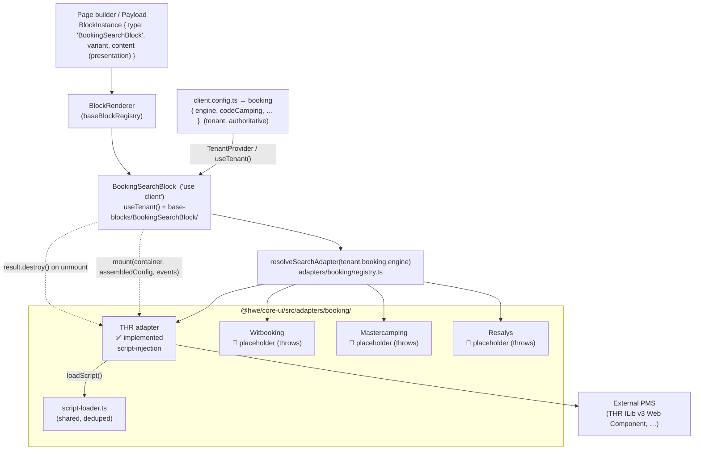
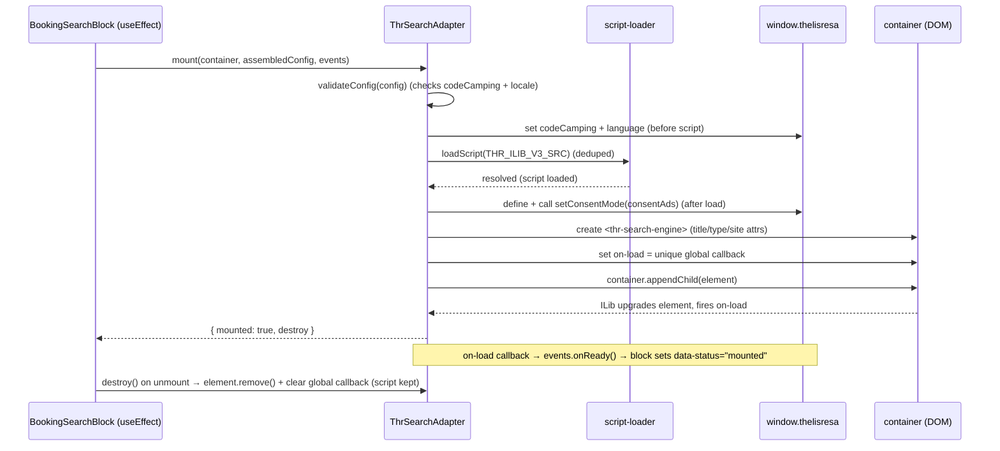

# Booking architecture — `BookingSearchBlock` + the booking adapter layer

> How the booking search UI in `@hwe/core-ui` renders an engine-agnostic block that delegates to a per-engine adapter resolved from config. Implements [DEC-017](../architecture/decisions.md#dec-017--repo-split-tools-submodule--core-npm--template--client-repos) (adapter inside `@hwe/core-ui`) and [DEC-025](../architecture/decisions.md#dec-025--booking-adapter-pattern--engine-agnostic-blocks-with-ui-delegation) (this pattern). Composes with [DEC-023](../architecture/decisions.md#dec-023--variant-bridge-blocks-read-the-variant-string-media-is-a-content-discriminated-union) (the `variant` string bridge).
>
> **Code is the source of truth.** This file is for orientation; read the files in the [file map](#file-map) for detail.

## Overview

`BookingSearchBlock` renders a property's availability search widget. Booking engines integrate in fundamentally different ways — THR injects a third-party script that renders its own Web Component, others embed an iframe, others would be a native form we build and submit to an API. A single block trying to handle every engine would need per-engine conditionals in `@hwe/core-ui` (forbidden — no `if (engine === '…')` in core). Instead the block is **engine-agnostic**: the **engine and its account credentials are authoritative in the tenant config** (`client.config.ts` → `booking`, a discriminated union by engine — DEC-025). The block reads them via `useTenant()`, resolves a `BookingSearchAdapter` for that engine, assembles the adapter config (tenant credentials + tenant locale + block presentation), and delegates the entire mount/destroy lifecycle to it. The block content carries **only presentation** (no engine, no fallback). Adding an engine means adding it to the tenant union + writing an adapter and registering it — the block never changes. The search widget is the first of several booking elements (`<thr-onenight>`, `<thr-favorites>`, …) that will be their own blocks sharing this layer.

## Architecture



The block owns three things only: the container element, the loading/error chrome, and the `data-engine` attribute (from `tenant.booking.engine`) used to scope CSS overrides. Everything inside the widget belongs to the engine. The adapter config it passes to `mount` is assembled as `{ ...tenant.booking, locale: tenant.locale, ...content }`.

## Configuration — tenant vs block

The engine + account credentials are declared **once per client** in `client.config.ts`; each block instance carries only presentation. The `codeCamping` (and equivalents) are **public** account IDs (visible in any THR site's HTML), so they live in config, not env vars.

```ts
// client.config.ts — tenant (authoritative). Discriminated union by engine.
export const config: TenantConfig = {
  name: 'Camping Mer et Camargue',
  locale: 'fr',
  booking: { engine: 'thr', codeCamping: 'demo', siteId: '6955' },
};

// A BookingSearchBlock instance — presentation only (no engine, no credentials):
{ type: 'BookingSearchBlock', variant: 'inline',
  content: { widgetTitle: 'Réservation', accommodationType: 'locatif' } }
```

`TenantConfig.booking` (in `providers/TenantProvider.tsx`) is the discriminated union:

```ts
booking?:
  | { engine: 'thr'; codeCamping: string; siteId?: string }
  | { engine: 'witbooking'; hotelId: string }          // placeholder names
  | { engine: 'mastercamping'; campingCode: string }    // until implemented
  | { engine: 'resalys'; propertyId: string };
```

If `booking` is absent, the block renders an always-visible config-error message (no retry). The app must be wrapped in `TenantProvider` for `useTenant()` to work (`site-demo/src/app/layout.tsx` does this).

## Integration types

The adapter declares its `integrationType` so the block (and the team) knows how a widget mounts. Defined in `adapters/booking/types.ts` as `SearchIntegrationType`.

| Type | How it mounts | Styling control | Engines |
|---|---|---|---|
| `script-injection` | Load an external `<script>`; the engine renders via custom elements / DOM injection. We own the container, they own the internals. | CSS overrides in client `globals.css`, scoped + `!important`. | **THR** ✅ |
| `iframe` | Mount an `<iframe>` at the engine URL with params. Fully isolated. | Minimal (URL params only). | TBD |
| `native` | We build the form with our primitives, then redirect or call the engine API on submit. | Full. | TBD |

## THR mount sequence

THR (eSeasonResa) ILib v3 uses Web Components. The adapter is `ThrSearchAdapter` (`integrationType: 'script-injection'`).



Key invariants (from `ThrSearchAdapter.ts` + `docs/integrations/bookings/thr/`):
- Global `thelisresa` config is set **before** the script loads; consent is set **after** (it depends on `thelisresa.ilib()`).
- The `<thr-search-engine>` element is inserted **after** the script registers the custom element.
- `destroy()` removes the element and its global callback but **keeps the script** — other THR widgets on the page may need it.
- The block depends on the `BookingSearchAdapter` interface, never on `ThrSearchAdapter` directly. Tests inject a fake adapter.

## File map

| Piece | Path |
|---|---|
| Adapter contract (port) + shared types | `@hwe/core-ui/src/adapters/booking/types.ts` |
| Engine → adapter resolution (map) | `@hwe/core-ui/src/adapters/booking/registry.ts` |
| Shared deduping script loader | `@hwe/core-ui/src/adapters/booking/script-loader.ts` |
| THR adapter | `@hwe/core-ui/src/adapters/booking/thr/ThrSearchAdapter.ts` |
| THR types / constants / mappings | `@hwe/core-ui/src/adapters/booking/thr/thr.types.ts` |
| The block (dispatcher, `'use client'`) | `@hwe/core-ui/src/base-blocks/BookingSearchBlock/BookingSearchBlock.tsx` |
| Block presentation variants (CVA) | `@hwe/core-ui/src/base-blocks/BookingSearchBlock/BookingSearchBlock.variants.ts` |
| Content schema (presentation only) | `@hwe/core-ui/src/schemas/BookingSearchBlock.schema.ts` |
| Tenant booking config (engine + credentials, union) | `@hwe/core-ui/src/providers/TenantProvider.tsx` (`TenantConfig.booking`) |
| Registry wiring (platform default) | `@hwe/core-ui/src/renderer/baseBlockRegistry.ts` |
| Engine integration docs | `docs/integrations/bookings/{engine}/` |

## CSS override pattern

External widgets ship their own styles with high specificity. The block sets `data-engine="{engine}"` on its `<section>`; clients restyle the widget from their own `globals.css` — never inside the block (zero CSS per block).

```css
/* site-{slug}/src/app/globals.css */
[data-engine="thr"] .thr-search-engine__btn {
  background-color: var(--color-primary) !important;
  border-radius: var(--radius-md) !important;
}
```

Rules: always scope to `[data-engine="…"]` (no naked `.thr-*`), use `!important` (the widget's specificity is high), use theme-token custom properties so overrides adapt per client. Class names are not documented by THR — inspect in DevTools and record them in `docs/integrations/bookings/thr/thr-notes.md`.

## Status — implemented vs not

| Item | Status |
|---|---|
| Adapter layer (types, registry, script-loader) | ✅ implemented |
| `BookingSearchBlock` (loading/mounted/error, retry, a11y) | ✅ implemented, registered as platform default |
| THR `<thr-search-engine>` adapter | ✅ implemented (script-injection) |
| Witbooking / Mastercamping / Resalys adapters | 🔴 placeholder factories that throw "not yet implemented" |
| Cookiebot → THR consent bridge | 🟡 adapter accepts `consentAds`; live Cookiebot wiring is a TODO |
| CSP domains for THR | 🟡 documented in `thr-notes.md`; not yet added to client CSP config |
| `TenantConfig.booking` (engine + credentials, discriminated union) | ✅ implemented; engine is authoritative at the tenant level, block content is presentation only |
| Multiple widgets / SPA re-navigation | 🟡 destroy/mount support it; not yet verified against a live THR account |

See the add-an-engine guide: [`docs/skills/frontend/booking-adapter.md`](../skills/frontend/booking-adapter.md).
