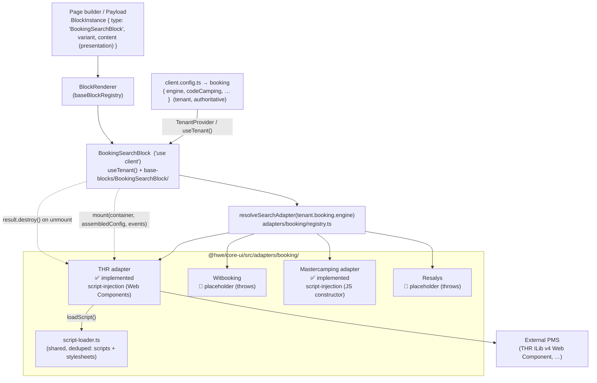

# Booking architecture — `BookingSearchBlock` + the booking adapter layer

> How the booking search UI in `@hwe/core-ui` renders an engine-agnostic block that delegates to a per-engine adapter resolved from config. Implements [DEC-017](../architecture/decisions.md#dec-017--repo-split-tools-submodule--core-npm--template--client-repos) (adapter inside `@hwe/core-ui`) and [DEC-025](../architecture/decisions.md#dec-025--booking-adapter-pattern--engine-agnostic-blocks-with-ui-delegation) (this pattern). Composes with [DEC-023](../architecture/decisions.md#dec-023--variant-bridge-blocks-read-the-variant-string-media-is-a-content-discriminated-union) (the `variant` string bridge).
>
> **Code is the source of truth.** This file is for orientation; read the files in the [file map](#file-map) for detail.

## Overview

`BookingSearchBlock` renders a property's availability search widget. Booking engines integrate in fundamentally different ways — THR injects a third-party script that renders its own Web Component, others embed an iframe, others would be a native form we build and submit to an API. A single block trying to handle every engine would need per-engine conditionals in `@hwe/core-ui` (forbidden — no `if (engine === '…')` in core). Instead the block is **engine-agnostic**: the **engine and its account credentials are authoritative in the tenant config** (`client.config.ts` → `booking`, a discriminated union by engine — DEC-025). The block reads them via `useTenant()`, resolves a `BookingSearchAdapter` for that engine, assembles the adapter config (tenant credentials + tenant locale + block presentation), and delegates the entire mount/destroy lifecycle to it. The block content carries **only presentation** (no engine, no fallback). Adding an engine means adding it to the tenant union + writing an adapter and registering it — the block never changes. The search widget is the first of several booking elements (`<thr-favorites>`, `<thr-simpleblock>`, …) that will be their own blocks sharing this layer.

## Architecture



The block owns three things only: the container element, the loading/error chrome, and the `data-engine` attribute (from `tenant.booking.engine`) used to scope CSS overrides. Everything inside the widget belongs to the engine. The adapter config it passes to `mount` is assembled as `{ ...tenant.booking, locale: tenant.locale, ...content }`.

## Configuration — tenant vs block

The engine + account credentials are declared **once per client** in `client.config.ts`; each block instance carries only presentation. The `codeCamping` (and equivalents) are **public** account IDs (visible in any THR site's HTML), so they live in config, not env vars.

```ts
// client.config.ts — tenant (authoritative). Discriminated union by engine.
export const config: TenantConfig = {
  name: 'Camping Mer et Camargue',
  locale: 'fr',
  booking: { engine: 'thr', codeCamping: 'demo', siteId: '6955' },
};

// A BookingSearchBlock instance — presentation only (no engine, no credentials):
{ type: 'BookingSearchBlock', variant: 'inline',
  content: { widgetTitle: 'Réservation', accommodationType: 'locatif' } }
```

`TenantConfig.booking` (in `providers/TenantProvider.tsx`) is the discriminated union:

```ts
booking?:
  | { engine: 'thr'; codeCamping: string; siteId?: string }
  | { engine: 'mastercamping'; idProperty: number; bookingUrl: string; layout?: 'vertical' | 'horizontal'; … }
  | { engine: 'witbooking'; hotelId: string }          // placeholder names
  | { engine: 'resalys'; propertyId: string };          // until implemented
```

If `booking` is absent, the block renders an always-visible config-error message (no retry). The app must be wrapped in `TenantProvider` for `useTenant()` to work (`site-demo/src/app/layout.tsx` does this).

### Placement & sticky

The block's presentation `variant` (per-instance) controls placement: `inline` (default, in flow), `sticky` (pins on scroll), `modal` (deferred). The sticky behavior is a **common default that's customized per design via tokens** — no code change per client:

| Token | Default | Set it to… |
|---|---|---|
| `--booking-sticky-top` | `0px` (pins to top) | the navbar height to stick **below the menu** instead of top:0 |
| `--booking-sticky-shadow` | `none` | a shadow per design, e.g. `var(--shadow-elevated)` |

```css
/* site-{slug}/globals.css — Figma wants it below the menu, with a shadow */
:root { --booking-sticky-top: var(--navbar-height, 4.5rem); --booking-sticky-shadow: var(--shadow-elevated); }
```

`sticky` uses CSS `position: sticky` (no JS, no layout jump). A design needing a fundamentally different sticky (condense-on-scroll, mobile collapse-to-button, desktop-only) is a Level-2/3 client block or a new variant — out of the common default.

## Integration types

The adapter declares its `integrationType` so the block (and the team) knows how a widget mounts. Defined in `adapters/booking/types.ts` as `SearchIntegrationType`.

| Type | How it mounts | Styling control | Engines |
|---|---|---|---|
| `script-injection` | Load an external `<script>`; the engine renders via custom elements / DOM injection. We own the container, they own the internals. | CSS overrides in the client's per-engine `src/app/booking/{engine}-overrides.css`, scoped + `!important`. | **THR** ✅ (Web Components), **Mastercamping** ✅ (JS constructor + static JS/CSS) |
| `iframe` | Mount an `<iframe>` at the engine URL with params. Fully isolated. | Minimal (URL params only). | TBD |
| `native` | We build the form with our primitives, then redirect or call the engine API on submit. | Full. | TBD |

## THR mount sequence

THR (eSeasonResa) ILib v4 uses Web Components. The adapter is `ThrSearchAdapter` (`integrationType: 'script-injection'`). Config is set through the `thelisresa.ilib(key, value)` queue (`camping`, `language`, `consent_ads`), not property assignment — see [`thr-ilib-v4.md`](../integrations/bookings/thr/thr-ilib-v4.md).

```mermaid
sequenceDiagram
  participant B as BookingSearchBlock (useEffect)
  participant A as ThrSearchAdapter
  participant L as script-loader
  participant W as window.thelisresa
  participant D as container (DOM)

  B->>A: mount(container, assembledConfig, events)
  A->>A: validateConfig(config)  (checks codeCamping + locale)
  A->>W: bootstrap thelisresa.ilib; queue ilib('camping'/'language'/'consent_ads')
  A->>L: loadScript(THR_ILIB_SRC = /ilib/v4/?searchengine)  (deduped)
  L-->>A: resolved (script loaded, queue consumed)
  A->>D: create <thr-search-engine> (title/type/site attrs)
  A->>D: set on-load = unique global callback
  A->>D: container.appendChild(element)
  D-->>A: ILib upgrades element, fires on-load
  A-->>B: { mounted: true, destroy }
  Note over A,W: on-load callback → events.onReady() → block sets data-status="mounted"
  B->>A: destroy() on unmount → element.remove() + clear global callback (script kept)
```

Key invariants (from `ThrSearchAdapter.ts` + `docs/integrations/bookings/thr/`):
- Config is queued via `thelisresa.ilib(key, value)` (`camping`, `language`, `consent_ads`) **before** the script loads; the v4 script consumes the queue on load (order is forgiving).
- The `<thr-search-engine>` element is inserted **after** the script registers the custom element.
- `destroy()` removes the element and its global callback but **keeps the script** — other THR widgets on the page may need it.
- The block depends on the `BookingSearchAdapter` interface, never on `ThrSearchAdapter` directly. Tests inject a fake adapter.

## File map

| Piece | Path |
|---|---|
| Adapter contract (port) + shared types | `@hwe/core-ui/src/adapters/booking/types.ts` |
| Engine → adapter resolution (map) | `@hwe/core-ui/src/adapters/booking/registry.ts` |
| Shared deduping script loader | `@hwe/core-ui/src/adapters/booking/script-loader.ts` |
| THR adapter | `@hwe/core-ui/src/adapters/booking/thr/ThrSearchAdapter.ts` |
| THR types / constants / mappings | `@hwe/core-ui/src/adapters/booking/thr/thr.types.ts` |
| Mastercamping adapter | `@hwe/core-ui/src/adapters/booking/mastercamping/MastercampingSearchAdapter.ts` |
| Mastercamping runtime (asset loading) / types | `@hwe/core-ui/src/adapters/booking/mastercamping/mastercamping-runtime.ts`, `mastercamping.types.ts` |
| The block (dispatcher, `'use client'`) | `@hwe/core-ui/src/base-blocks/BookingSearchBlock/BookingSearchBlock.tsx` |
| Block presentation variants (CVA) | `@hwe/core-ui/src/base-blocks/BookingSearchBlock/BookingSearchBlock.variants.ts` |
| Content schema (presentation only) | `@hwe/core-ui/src/schemas/BookingSearchBlock.schema.ts` |
| Tenant booking config (engine + credentials, union) | `@hwe/core-ui/src/providers/TenantProvider.tsx` (`TenantConfig.booking`) |
| Registry wiring (platform default) | `@hwe/core-ui/src/renderer/baseBlockRegistry.ts` |
| Engine integration docs | `docs/integrations/bookings/{engine}/` |

## CSS override pattern

External widgets ship their own styles. The block sets `data-engine="{engine}"` on its `<section>`; clients restyle the widget from a **per-engine override file** — `src/app/booking/{engine}-overrides.css`, imported conditionally in `layout.tsx` so a client loads only the engine it runs. Never inside the block (zero CSS per block), and never in `globals.css` (which stays engine-free, so a client ships no overrides for engines it doesn't use). These files hold **client brand customizations only** — base widget styles ship in the vendor bundle (loaded by the adapter); don't duplicate them. The block also **constrains its own layout** (centers within `--width-container`) so a `width:100%` widget isn't full-bleed.

**THR specifics (verified):** the widget is **AngularJS light DOM** (overrides reach it — not shadow DOM/iframe), styled with **Bootstrap 3 + an account-theme layer that uses `!important`** (the account's `color1`/`color2`). So theming is **two layers**: (1) the account colours set **in THR's back-office** per client; (2) CSS overrides here. Because THR's rules use `!important`, overrides need **`!important` AND extra specificity** (chain a second class).

```css
/* site-{slug}/src/app/booking/thr-overrides.css — token-driven, beats THR's themed !important */
[data-engine="thr"] .btn.btn-primary,
[data-engine="thr"] .thr-btn-search {
  background-color: var(--color-primary) !important;
  border-radius: var(--radius-md) !important;
}
```

Rules: always scope to `[data-engine="…"]`; use `!important` + extra specificity; use theme tokens so overrides adapt per client. The full THR class map + baseline live in [`thr-notes.md` §CSS](../integrations/bookings/thr/thr-notes.md) (THR doesn't publish class names; v4 is its stable/only version, so they're fixed once captured). Working example: `site-demo/src/app/booking/{mastercamping,thr}-overrides.css`, imported conditionally in `site-demo/src/app/layout.tsx`.

## Status — implemented vs not

| Item | Status |
|---|---|
| Adapter layer (types, registry, script-loader) | ✅ implemented |
| `BookingSearchBlock` (loading/mounted/error, retry, a11y) | ✅ implemented, registered as platform default |
| THR `<thr-search-engine>` adapter | ✅ implemented (script-injection, Web Components) |
| Mastercamping `MasterWidget` adapter | ✅ implemented (script-injection, JS constructor + static JS/CSS assets; `layout` vertical/horizontal) |
| Witbooking / Resalys adapters | 🔴 placeholder factories that throw "not yet implemented" |
| Cookiebot → THR consent bridge | 🟡 adapter accepts `consentAds`; live Cookiebot wiring is a TODO |
| CSP domains for THR | 🟡 documented in `thr-notes.md`; not yet added to client CSP config |
| `TenantConfig.booking` (engine + credentials, discriminated union) | ✅ implemented; engine is authoritative at the tenant level, block content is presentation only |
| Multiple widgets / SPA re-navigation | 🟡 destroy/mount support it; not yet verified against a live THR account |

See the add-an-engine guide: [`docs/skills/frontend/booking-adapter.md`](../skills/frontend/booking-adapter.md).
