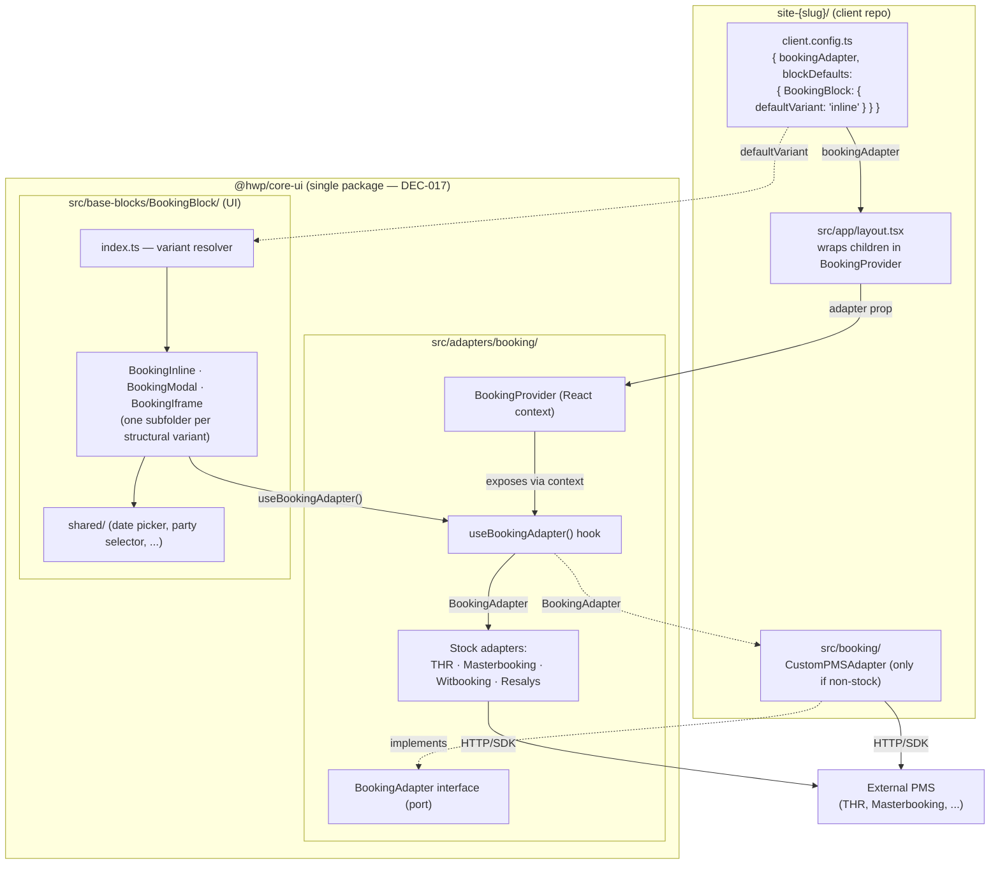

# Booking architecture — `BookingBlock` and `BookingAdapter`

> How the booking UI in `@hwp/core-ui` consumes a PMS adapter via React context, without ever importing a concrete adapter. Materialises [DEC-010](../architecture/decisions.md#dec-010--bookingblock-in-hwpcore-ui-bookingprovider-in-hwpbooking) and [DEC-017](../architecture/DEC-017-Repo-Split.md) (adapter moved inside `@hwp/core-ui`). Composes with [DEC-008](../architecture/decisions.md#dec-008--structural-variants-for-complex-blocks) (structural variants) and [DEC-009](../architecture/decisions.md#dec-009--remove-activeblocks-add-blockdefaults-to-clientconfigts) (per-client defaults).



## Key invariants

- **`BookingBlock` and `BookingProvider` both live in `@hwp/core-ui`** ([DEC-017](../architecture/DEC-017-Repo-Split.md)). There is no separate `@hwp/booking` package. Adapters (interface + stock implementations + provider + hook) live in `@hwp/core-ui/src/adapters/booking/`.
- **`@hwp/core-ui/src/adapters/` exports zero UI components.** UI belongs in `base-blocks/`. The adapter layer is domain + infrastructure plumbing only.
- **The block depends on the interface, not on a concrete adapter.** Variants call `useBookingAdapter()` and receive whatever the app wired at the root. Hexagonal: UI depends on the port, infrastructure provides the adapter.
- **Tests run without any real PMS.** A fake adapter is injected via `<BookingProvider adapter={fake}>`; coverage stays in the unit/integration band ([DEC-006](../architecture/decisions.md#dec-006--testing-toolchain-vitest--playwright--testing-library)).

## Root layout wiring

```tsx
// site-{slug}/src/app/layout.tsx
import { BookingProvider } from '@hwp/core-ui';
import { config } from '@/client.config';

export default function RootLayout({ children }: { children: React.ReactNode }) {
  return (
    <BookingProvider adapter={config.bookingAdapter}>
      {children}
    </BookingProvider>
  );
}
```

## Adding a custom PMS adapter

For a client whose PMS is not in the stock list, the adapter lives in the client repo:

```ts
// site-{slug}/src/booking/CustomPMSAdapter.ts
import type { BookingAdapter } from '@hwp/core-ui';

export const customPMSAdapter: BookingAdapter = {
  checkAvailability: async (params) => { /* ... */ },
  createReservation:  async (params) => { /* ... */ },
};
```

Wire it in `client.config.ts`:
```ts
import { customPMSAdapter } from '@/booking/CustomPMSAdapter';
export const config = { bookingAdapter: customPMSAdapter, ... } as const;
```
