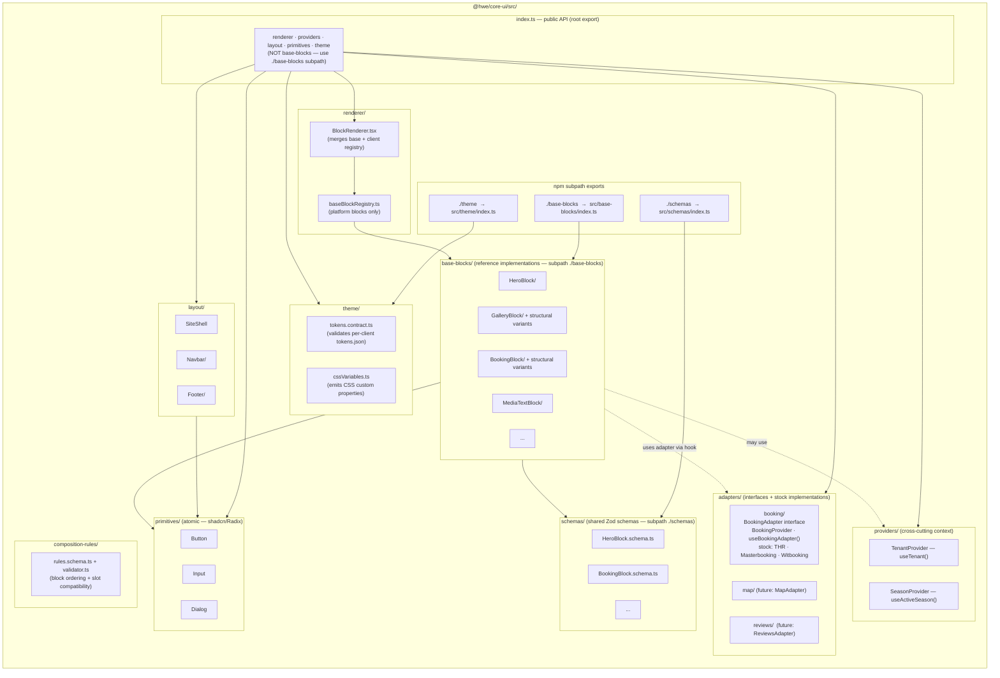

# `@hwe/core-ui` internal structure

> Internal layout of the `@hwe/core-ui` package (in `hwe-core/packages/core-ui/`). Shows the layers (primitives → base-blocks → renderer), the adapter layer, and the cross-cutting concerns (providers, theme, composition-rules).
>
> Companion to [`docs/contracts/frontend/structure.md`](../contracts/frontend/structure.md) and [`docs/contracts/frontend/block-contract.md`](../contracts/frontend/block-contract.md).

## Rules encoded in the diagram

- **Layering is one-way:** `base-blocks → primitives → nothing`. A primitive never imports a block. A block never imports a layout. Inversions break the abstraction.
- **`base-blocks/` renamed from `blocks/`** (DEC-015). Never `blocks/` again. Client blocks live in `src/blocks/` of the client repo, never here.
- **`schemas/` is separate from `base-blocks/`** (DEC-015). Payload and client code that need only the Zod schema import `@hwe/core-ui/schemas` — they don't pull in the React component.
- **`adapters/booking/`** contains `BookingAdapter` interface, `BookingProvider`, `useBookingAdapter()`, and stock PMS adapters. No UI components here. This was previously a separate `@hwe/booking` package — merged into `@hwe/core-ui` per DEC-017.
- **`BlockRenderer` receives two registries:** `baseBlockRegistry` (platform) + an optional `blocks` prop from the client. Client blocks override platform blocks of the same key. See [`block-resolution-chain.md`](./block-resolution-chain.md).
- **`theme/`** holds the contract (`tokens.contract.ts`) and CSS variable helpers. Token values live per-client in `src/theme/tokens.json` and flow via `@theme {}` blocks in `globals.css` (Tailwind v4 CSS-first).
- **Only `index.ts` (root) and subpath `index.ts` files re-export.** No internal barrels inside folders. Exception: a block with structural variants has an `index.ts` that acts as the variant resolver, not a barrel ([DEC-008](../architecture/decisions.md#dec-008--structural-variants-for-complex-blocks)).
