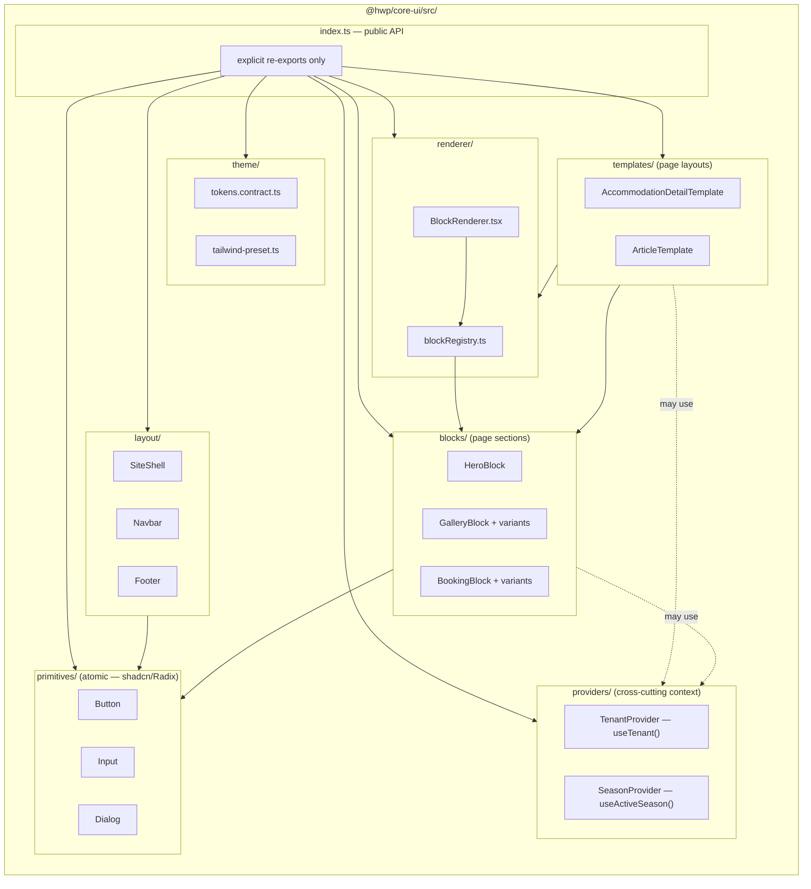

# `@hwp/core-ui` internal structure

> Internal layout of the `@hwp/core-ui` package. Shows the layers (primitives → blocks → templates), the cross-cutting layers (renderer, providers, theme), and the dependency direction between them.
>
> Companion to [`docs/frontend/structure.md`](../contracts/frontend/structure.md) and [`docs/frontend/block-contract.md`](../contracts/frontend/block-contract.md).

## Rules encoded in the diagram

- **Layering is one-way:** `templates → blocks → primitives`. A primitive never imports a block. A block never imports a template. Inversions break the abstraction.
- **`renderer/`** is the bridge between Payload data and the typed component world. `blockRegistry.ts` maps `BlockType → { component, contentSchema, variants? }` ([DEC-008](../architecture/decisions.md#dec-008--structural-variants-for-complex-blocks) adds the optional `variants` key).
- **`providers/`** holds cross-cutting context (`TenantProvider`, `SeasonProvider`). `BookingProvider` is NOT here — it lives in `@hwp/booking` ([DEC-010](../architecture/decisions.md#dec-010--bookingblock-in-hwpcore-ui-bookingprovider-in-hwpbooking)) because the booking domain owns its own context.
- **Only `index.ts` re-exports.** No internal barrels (`blocks/index.ts`, `primitives/index.ts`). The one controlled exception: a block with structural variants has an `index.ts` that is the **variant resolver**, not a barrel ([DEC-008](../architecture/decisions.md#dec-008--structural-variants-for-complex-blocks)).
- **`theme/`** holds the contract (`tokens.contract.ts`) and the Tailwind preset, not concrete token values. Token values live per-client in `apps/site-{slug}/src/theme/tokens.json` (or per-season files for clients with `hasSeasons` — [DEC-005](../architecture/decisions.md#dec-005--per-season-theme-tokens-for-clients-with-hasseasons)).
