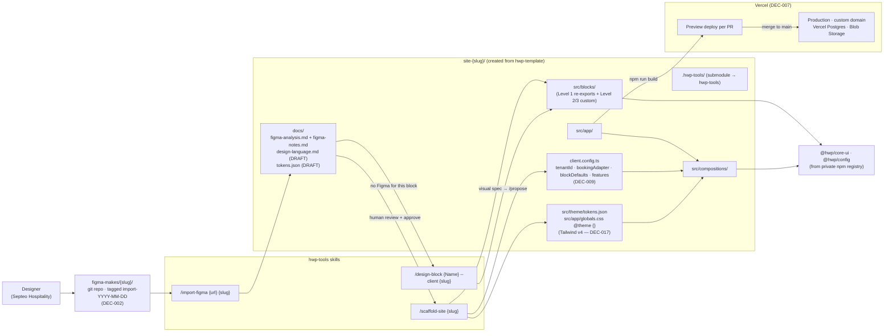

# Figma to production — client onboarding flow

> End-to-end flow of bringing a new client from a Figma Make export to a deployed site on Vercel. Combines [DEC-002](../architecture/decisions.md#dec-002--one-figma-make-repo-per-client-tagged-per-import) (Figma-per-client), [DEC-007](../architecture/decisions.md#dec-007--vercel-full-stack-hosting-replaces-cdmon--hetzner--mariadb) (Vercel), [DEC-017](../architecture/DEC-017-Repo-Split.md) (3-repo structure), and [DEC-009](../architecture/decisions.md#dec-009--remove-activeblocks-add-blockdefaults-to-clientconfigts) (`blockDefaults`).

## Key invariants

- **Figma is reference, not codegen.** Classification (block vs template vs composition) is a human-led step driven by [`domain-model.md §7`](../architecture/domain-model.md).
- **Per-client surface stays small.** Most work for client N+1 is `client.config.ts` + `globals.css @theme {}` + a few compositions. Blocks come from `@hwp/core-ui/base-blocks`.
- **Re-imports preserve history.** [`/import-figma`](../../.claude/skills/import-figma/SKILL.md) runs `git pull --ff-only` and adds a new dated tag — old exports stay reachable via `git checkout import-YYYY-MM-DD`.
- **Preview deploys are the design review surface.** Every PR gets a Vercel preview URL; the designer reviews the rendered site, not a Figma diff.
- **Design language fills the gap.** When the designer hasn't provided a Figma for a specific block, `/design-block` reads `docs/design-language.md` (extracted by `/import-figma`) to generate a consistent visual spec — no ad-hoc improvisation.
