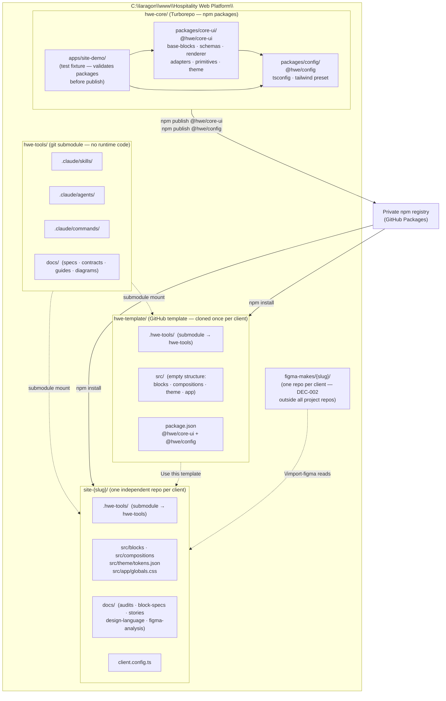

# Platform overview — 3-repo architecture

> High-level map of the hwe platform as of DEC-017: three purpose-built repos, independent client repos, and Figma Make repos outside everything.
>
> Conventions: arrows point in the direction of **dependency**. Dashed arrows are submodule mounts or git references, not npm imports.

## Reading the diagram

- **`hwe-tools`** is a pure text repo (skills, agents, docs). No Node.js runtime. Versioned with git tags (`v1.0.0`). Mounted as `.hwe-tools/` in every client repo and in `hwe-template`.
- **`hwe-core`** is the Turborepo workspace that compiles and publishes `@hwe/core-ui` and `@hwe/config`. `apps/site-demo/` lives here as the integration test fixture — it validates packages before they are published.
- **`hwe-template`** is a GitHub template repo. Cloned once per client with "Use this template". Contains the `.hwe-tools/` submodule and a pre-wired `package.json` pointing to `@hwe/core-ui` and `@hwe/config`.
- **`site-{slug}/`** repos are independent — each has its own git history, its own Vercel project, its own `package.json`. They consume `@hwe/*` from the private registry. Claude Code reads `.hwe-tools/` for skills and docs.
- **`figma-makes/{slug}/`** are the designer's repos, tagged per import ([DEC-002](../architecture/decisions.md#dec-002--one-figma-make-repo-per-client-tagged-per-import)). `/import-figma` reads them and writes outputs to the client repo's `docs/`.

## What this diagram does NOT show

- Internal layout of `@hwe/core-ui` (base-blocks, schemas, renderer, adapters) — see [`core-ui-internal.md`](./core-ui-internal.md).
- Block resolution chain (base registry + client registry merge) — see [`block-resolution-chain.md`](./block-resolution-chain.md).
- Token cascade (global → semantic → brand) — see [`token-cascade.md`](./token-cascade.md).
- Deploy targets (Vercel) — see [DEC-007](../architecture/decisions.md#dec-007--vercel-full-stack-hosting-replaces-cdmon--hetzner--mariadb).
