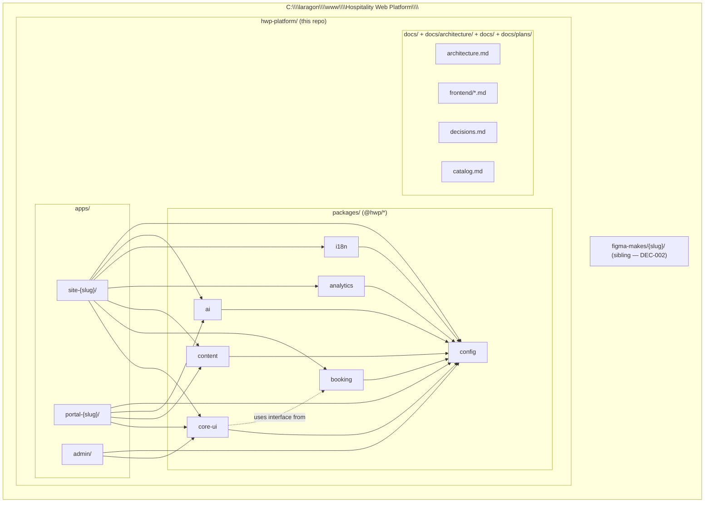

# Monorepo overview

> High-level map of the `hwp-platform/` monorepo: where source lives, where documentation lives, and which package depends on which. Companion to [`docs/frontend/structure.md`](../contracts/frontend/structure.md).
>
> Conventions: arrows point in the direction of **dependency** (A → B means "A depends on B"). `@hwp/*` packages are workspace packages published via GitHub Packages. `apps/*` and `figma-makes/*` are deployable units, not packages.

## Reading the diagram

- **`apps/site-{slug}/`** depends on every domain package: it composes blocks (`@hwp/core-ui`), wires booking (`@hwp/booking`), reads content (`@hwp/content`), tracks analytics (`@hwp/analytics`), and renders translations (`@hwp/i18n`).
- **`@hwp/core-ui`** has a *typed* dependency on `@hwp/booking` (the `BookingAdapter` interface) but never imports a concrete adapter ([DEC-010](../architecture/decisions.md#dec-010--bookingblock-in-hwpcore-ui-bookingprovider-in-hwpbooking)). The dashed line marks that dependency as interface-only.
- **`@hwp/config`** is the leaf that everyone shares (tsconfig, eslint, tailwind preset, vitest preset).
- **`figma-makes/{slug}/`** lives **outside** `hwp-platform/` ([DEC-002](../architecture/decisions.md#dec-002--one-figma-make-repo-per-client-tagged-per-import)). Each client has its own clone of the designer's repo, tagged per import.

## What this diagram does NOT show

- Internal layout of `@hwp/core-ui` (primitives/blocks/templates/renderer/providers) — see [`core-ui-internal.md`](./core-ui-internal.md).
- Deploy targets (Vercel) — see [`docs/architecture.md`](../architecture/architecture.md) §Arquitectura de Deploy and [DEC-007](../architecture/decisions.md#dec-007--vercel-full-stack-hosting-replaces-cdmon--hetzner--mariadb).
