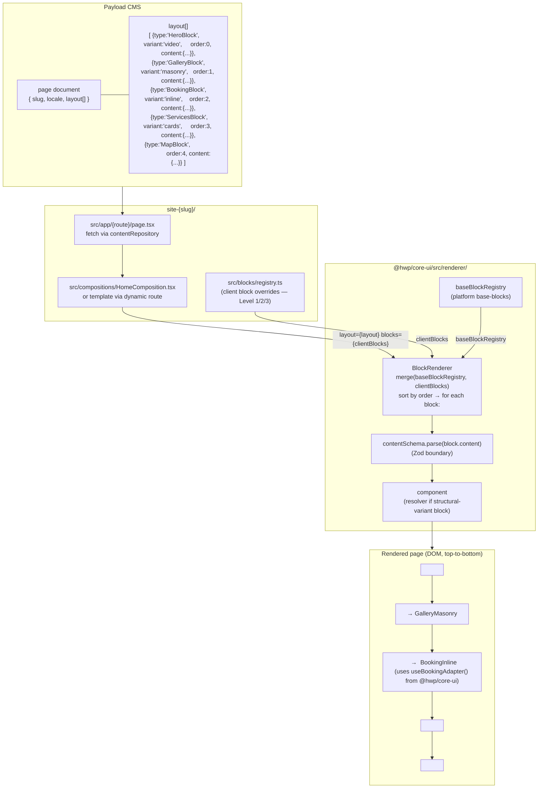

# Page tetris — how a page is composed from blocks

> A rendered page is a "tetris" of blocks: Payload stores an ordered `layout[]` of typed block entries, the renderer iterates them, each block resolves to its (possibly structural) variant, and the page is assembled top-to-bottom. This diagram shows the data flow from CMS storage to rendered DOM.
>
> Companion to [`block-contract.md`](../contracts/frontend/block-contract.md), [`template-contract.md`](../contracts/frontend/template-contract.md), and [`block-variant-resolution.md`](./block-variant-resolution.md).

## Why "tetris"?

Pages are not custom-coded per client. They are **assembled** from a fixed catalog of blocks the platform knows how to render. The CMS chooses *which* blocks, *which* variant of each, and *what order*. The page is the sum of those pieces — the same way tetris pieces stack to form a board.

Key consequences:

- **Adding a new block to the catalog** means one folder in `@hwp/core-ui/src/base-blocks/` plus one entry in `baseBlockRegistry.ts`. Every page in every client site can use it immediately (after publishing a new version).
- **Changing the order of a page** is a CMS edit, not a code change. The editor reorders `layout[]` in Payload.
- **Per-client styling** comes from `@theme {}` token overrides in `globals.css` (Tailwind v4), not from forking a page. A `HeroBlock` looks different on `client-a` and `client-b` because the tokens differ, not because the component differs.
- **Per-client structural choices** come from `blockDefaults` in `client.config.ts` ([DEC-009](../architecture/decisions.md#dec-009--remove-activeblocks-add-blockdefaults-to-clientconfigts)) — e.g. one client defaults to `BookingInline`, another defaults to `BookingIframe`. Both use the same `BookingBlock`.
- **Client overrides shadow platform blocks** of the same `type` key via the `blocks` prop of `BlockRenderer`. See [`block-resolution-chain.md`](./block-resolution-chain.md) for the full resolution chain.

## Tetris vs templates

A **template** ([template-contract.md](../contracts/frontend/template-contract.md)) is a more constrained tetris: the schema declares a Base + Optional + Sections layout. Base fields render unconditionally, Optional fields render when present, Sections delegates to `BlockRenderer`. Templates are how dynamic pages (one accommodation per slug, one article per slug) handle heterogeneous entities without per-entity code.

A **composition** (`src/compositions/` in the client repo) is a hand-assembled JSX that pulls in blocks directly. Used for static pages (Home, Contact, About) where the layout is fixed for that client.
