# Token cascade — global → semantic → brand

> How design tokens flow from the platform defaults down to a client's specific colors and fonts, using Tailwind v4's CSS-first `@theme` system. Materialises the three-layer cascade from [DEC-015](../architecture/decisions.md#dec-015--client-owned-blocks-with-shared-schemas-slot-based-composition-and-npm-subpath-exports) §8 and [DEC-017](../architecture/DEC-017-Repo-Split.md) (Tailwind v4 CSS-first).
>
> Companion to [`docs/contracts/frontend/theme-tokens.md`](../contracts/frontend/theme-tokens.md).

```mermaid
flowchart TB
  subgraph layer1["Layer 1 — Global (platform baseline)\n@hwe/config/theme.css  ·  published in @hwe/config npm package"]
    direction LR
    g1["--radius-sm: 4px\n--radius-md: 8px\n--spacing-section-y: 80px\n--width-container: 1280px\n(structural / spacing defaults)"]
  end

  subgraph layer2["Layer 2 — Semantic (neutral palette)\n@hwe/config/theme.css  ·  same file, second @theme block"]
    direction LR
    g2["--color-background: #ffffff\n--color-foreground: #1a1a1a\n--color-surface: #f5f5f5\n--color-primary: #374151  (placeholder — must override)\n--color-accent: #6b7280   (placeholder — must override)\n--font-heading: system-ui, sans-serif  (placeholder)\n--font-body: system-ui, sans-serif    (placeholder)"]
  end

  subgraph layer3["Layer 3 — Brand (per-client overrides)\nsite-{slug}/src/app/globals.css  ·  @theme { } block"]
    direction LR
    g3["--color-primary: #1A4A52\n--color-primary-foreground: #ffffff\n--color-accent: #9FCAD0\n--color-accent-foreground: #1A4A52\n--font-heading: 'Playfair Display', Georgia, serif\n--font-body: 'Montserrat', system-ui, sans-serif\n--spacing-section-y: 80px  (may keep or override)"]
  end

  subgraph build["Tailwind v4 build output\n(CSS custom properties emitted to :root)"]
    direction LR
    css[":root {\n  --color-primary: #1A4A52;   ← brand wins\n  --color-accent: #9FCAD0;    ← brand wins\n  --font-heading: 'Playfair Display', ...;\n  --radius-md: 8px;            ← global (not overridden)\n  --spacing-section-y: 80px;   ← global (not overridden)\n}"]
  end

  subgraph utilities["Tailwind utility classes generated"]
    direction LR
    utils["bg-primary  → background-color: var(--color-primary)\ntext-accent  → color: var(--color-accent)\nfont-heading → font-family: var(--font-heading)\nrounded-md   → border-radius: var(--radius-md)\npy-section-y → padding-block: var(--spacing-section-y)"]
  end

  subgraph component["Component (e.g. HeroBlock.tsx)"]
    direction LR
    comp["<section className='bg-primary text-on-dark py-section-y'>\n  <h1 className='font-heading text-4xl'>{content.title}</h1>\n</section>\n\nNo hex codes. No hardcoded fonts.\nOnly token utilities."]
  end

  subgraph season["Seasonal override (optional — DEC-005)\nsite-{slug}/src/theme/tokens-winter.json\n→ wrapped in [data-season='winter'] selector"]
    s1["--color-primary: #2C4A7C  (winter blue)\n--color-accent: #A8C4E8\napplied on <html data-season='winter'>"]
  end

  layer1 --> layer2
  layer2 --> layer3
  layer3 --> build
  build --> utilities
  utilities --> component
  layer3 -.optional seasonal variant.-> season
  season -.overrides at runtime.-> build
```



## Cascade rules

1. **Layer 1 (global)** provides structural constants: spacing scale, container widths, border radii, shadow presets. These change rarely and are shared across all clients.
2. **Layer 2 (semantic)** provides placeholder colors and fonts. A site built without overriding these renders in neutral gray — intentionally ugly, forcing the developer to supply brand values.
3. **Layer 3 (brand)** is the client's `@theme {}` block in `globals.css`. It shadows only the tokens that differ from the platform defaults. A client that keeps the platform's spacing defaults just omits those lines.

## How to apply tokens in a component

```ts
// ✅ Correct — use token utilities
<section className="bg-primary text-on-dark py-[--spacing-section-y]">
  <h1 className="font-heading text-3xl">{content.title}</h1>
</section>

// ❌ Wrong — hardcoded hex, breaks when the client's tokens change
<section style={{ backgroundColor: '#1A4A52', color: 'white' }}>
```

Rule from [`docs/specs/frontend/frontend-standards.md`](../specs/frontend/frontend-standards.md): **NEVER use hex codes or hardcoded font names in `.tsx` files when a token exists.**

## Season override (DEC-005)

For clients with `hasSeasons`, a secondary `tokens-{seasonSlug}.json` provides alternate values for `--color-primary`, `--color-accent`, etc. These are wrapped in a CSS selector `[data-season='winter'] { ... }` at build time. The server sets `data-season` on `<html>` based on the active season — no extra JS, no runtime swap.

```css
/* generated by Tailwind v4 for a seasonized client */
:root { --color-primary: #1A4A52; }             /* base (summer) */
[data-season="winter"] { --color-primary: #2C4A7C; }  /* winter override */
```
