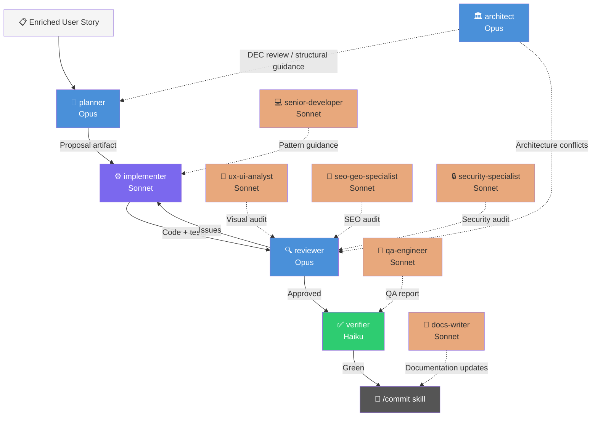

# Agent Directory

> All 11 agents live in `.claude/agents/`. Each is a specialized sub-agent Claude Code can invoke for a specific domain of work. This file is the single reference for what each agent does, which model it runs on, and when to call it.

---

## Pipeline SPECBOOT

Four agents forming the sequential quality pipeline. Run them **in order** for every non-trivial user story. Each phase has a hard input/output contract.

| Agent | Role | Model | Files it owns | When to invoke |
|---|---|---|---|---|
| `planner` | Reads an enriched US and produces a concrete proposal artifact: files to touch, patterns to follow, data schemas, test plan | Opus | `docs/architecture/`, `docs/contracts/`, existing code (read-only) | `/propose` — after `/enrich-us` enriched the story |
| `implementer` | Executes the approved proposal TDD-first: test → see fail → implement → see pass → refactor | Sonnet | `packages/*/src/`, `apps/*/src/`, `coding-standards.md`, `security-standards.md` (when touching Route Handlers or forms) | `/apply` — after planner produces proposal |
| `reviewer` | Independent diff review. Sees **only** the diff + story + standards. Never the proposal. Severity-tagged findings or approval | Opus | git diff, story, `base-standards.md`, `coding-standards.md` (frontend diffs), `security-standards.md` (Route Handlers / forms / AI integrations) | `/review` — after implementer finishes |
| `verifier` | Mechanical CI: typecheck → test → lint → build, fail-fast. Binary green/red + raw log | Haiku | pnpm workspace commands | `/verify` — after reviewer approves |

---

## Domain Specialists

Seven read-only specialists. They **audit, report, and recommend** — they never write application code, never commit, never install packages. Invoke them as consultants at any phase.

| Agent | Role | Model | Domain files | When to invoke |
|---|---|---|---|---|
| `architect` | Platform guardian. Owns DECs, contracts, domain model, package boundaries. Produces DEC proposals and architecture reviews | Opus | `docs/architecture/`, `docs/contracts/`, `docs/specs/`, `turbo.json` | Before any structural change; when new DEC needed; when planner crosses package boundaries |
| `senior-developer` | Core package expert. Reference for existing patterns in `packages/*/src/`. Guides implementer on idioms and conventions | Sonnet | `packages/*/src/`, `coding-standards.md`, `security-standards.md` (when block handles user input) | When implementer needs pattern guidance; as team lead for complex block work |
| `ux-ui-analyst` | Visual fidelity guardian. Compares implemented blocks against Figma reference. Produces visual audit reports | Sonnet | `figma-makes/*/src/`, `packages/core-ui/src/base-blocks/`, `site-{slug}/src/blocks/`, `apps/*/src/theme/` | After each block implemented; after tokens extracted; for full-page composition audits |
| `seo-geo-specialist` | Search visibility guardian. Audits semantic HTML, heading hierarchy, structured data, meta tags, local SEO | Sonnet | `packages/core-ui/src/base-blocks/`, `site-{slug}/src/blocks/`, `apps/*/src/app/layout.tsx`, `apps/*/public/`, `docs/specs/seo/` | After each block created; during new site setup; pre-deploy |
| `security-specialist` | Data protection guardian. Audits RGPD compliance, input handling, headers, CSP, cookies, secrets, dependencies | Sonnet | All files touching user input, cookies, or external APIs; `next.config.mjs`; `package.json`; `docs/specs/security/security-standards.md` (primary reference) | After any block handling user input; during site setup; pre-deploy |
| `qa-engineer` | Quality guardian beyond CI. Tests user-facing behavior, responsiveness, accessibility beyond axe, cross-block integration | Sonnet | Rendered pages at localhost, all `src/` files | After compositions assembled; pre-deploy; after significant block changes |
| `docs-writer` | Knowledge guardian. Creates and maintains skills, guides, plans, stories, catalog, README | Sonnet | `docs/skills/`, `docs/guides/`, `docs/plans/`, `docs/stories/`, `docs/catalog.md`, `docs/README.md` | After any phase completes; when new patterns established; after structural decisions |

---

## How they integrate

**Solid arrows** = sequential pipeline (output of one is input of next).
**Dashed arrows** = optional specialist consultation at any phase.

---

## In simple terms

**En WordPress:** cuando construyes el site de un camping, lo haces todo tú — configuras el plugin de reservas, ajustas el theme, optimizas el SEO, revisas que funcione en móvil, compruebas el RGPD.

**En HWP con agentes:** tienes un equipo de especialistas que convocas según la tarea. Cada uno sabe exactamente lo que tiene que hacer y no se mete en lo de los demás.

| En WordPress... | En HWP con agentes... |
|---|---|
| Tú solo diseñas cómo implementar algo | `planner` diseña la solución técnica |
| Tú solo escribes el código | `implementer` escribe el código TDD-first |
| Pides a un colega que revise el PR | `reviewer` hace una revisión independiente |
| Ejecutas `npm run build` a ver si pasa | `verifier` ejecuta todos los gates automáticamente |
| Piensas si el SEO está bien | `seo-geo-specialist` audita el HTML semántico |
| Comparas el diseño con el Figma manualmente | `ux-ui-analyst` hace la auditoría visual |
| Rezas para que no haya problemas de seguridad | `security-specialist` audita RGPD y headers |

No necesitas ser experto en todo. Delegas al especialista correcto en el momento correcto.
