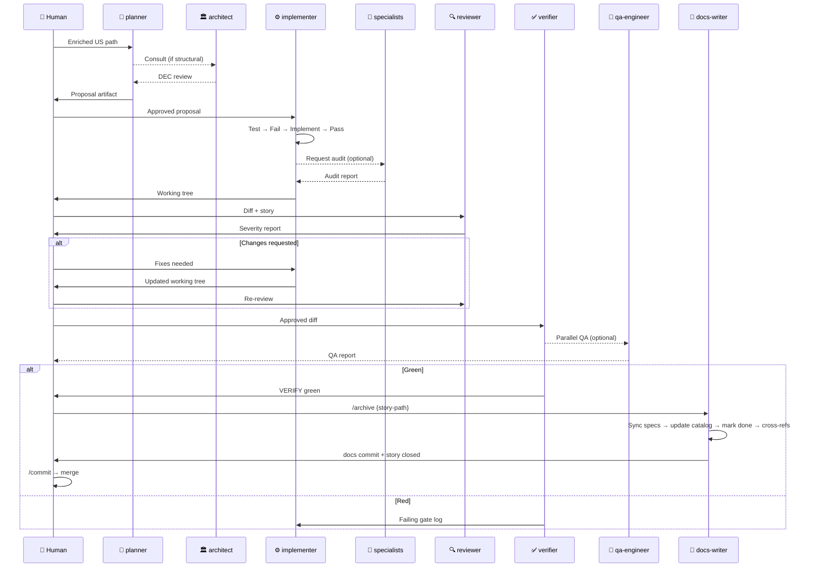

# SPECBOOT Flow

> The quality pipeline that turns an enriched user story into merged, verified code. Five phases, five agents, one direction — no skipping.

---

## The five phases

### Phase 1 — `/propose` → `planner` (Opus)

**Input:** An enriched user story (`docs/plans/{epic}/stories/US-NNN-{slug}.md`) with Description, Scope, Dependencies, and Acceptance Criteria sections.

**What the planner does:**
- Reads the story verbatim
- Loads the minimum relevant docs (domain-model.md, relevant contracts, existing code it will touch)
- Designs HOW to implement WHAT the story asks
- Produces a **proposal artifact** — a markdown document the implementer can follow without further questions

**What the proposal contains:**
- Affected files table (path, change type, why)
- Patterns to follow (existing file to mirror)
- Data and schemas (Zod field-level detail if applicable)
- Tests to write (paths, scenarios, behavior names)
- Risks and open questions (flagged, not invented)
- Out of scope (explicit boundary)

**Output:** `docs/plans/{epic}/proposals/US-NNN-proposal.md`

**Specialist to consult (optional):**
- `architect` — if the story crosses package boundaries or needs a new DEC
- `seo-geo-specialist` — if the proposed semantic structure needs validation before implementation

---

### Phase 2 — `/apply` → `implementer` (Sonnet)

**Input:** The approved proposal artifact.

**What the implementer does (strictly in order):**
1. **Write the test first** — test file at the path the proposal specifies, covering all AC scenarios
2. **Run the test — see it fail** — meaningful failure (not import error, not syntax error)
3. **Write the implementation** — minimum code to make the test pass
4. **Run the test — see it pass** — if it doesn't pass, fix the implementation (not the test)
5. **Refactor (optional)** — only if simpler result without breaking tests
6. **Verify the package** — `pnpm --filter {package} typecheck && test && lint`

**Rules:**
- No `any`, no `@ts-ignore`
- Zod at every boundary
- No `if (client === '...')` in core packages
- No git operations — the implementer writes, not commits

**Output:** Modified/created source files + test files. Working tree ready for review.

**Specialist to consult (optional):**
- `senior-developer` — for pattern guidance on existing idioms
- Specialists run **after** implementation, before handing to reviewer

---

### Phase 3 — `/review` → `reviewer` (Opus)

**Input:** The diff (`git diff main...HEAD`) + the user story. **NOT** the proposal (independence is the value).

**What the reviewer does:**
- Reads the full diff, hunk by hunk
- Checks every AC has a test that covers it
- Applies the full checklist: correctness, type safety, multi-tenant integrity, architecture, testing rigor, conventions, scope discipline
- Produces a severity-tagged report: Blocker / Major / Minor / Nit

**Output:** Review document with verdict — one of:
- `"Approved."` — no blockers, no majors
- `"Approved with minors."` — list them, don't block
- `"Changes requested."` — at least one blocker or major → back to implementer

**Specialists to consult (optional, before or in parallel):**
- `ux-ui-analyst` — visual audit for blocks
- `seo-geo-specialist` — semantic HTML audit
- `security-specialist` — data handling, RGPD, headers

Specialist reports go **to the reviewer as input**, not directly to the implementer. The reviewer incorporates findings into the final severity-tagged report.

---

### Phase 4 — `/verify` → `verifier` (Haiku)

**Input:** The approved working tree.

**What the verifier does:** runs four gates in order, fail-fast:

```
1. pnpm -r typecheck
2. pnpm -r test --run
3. pnpm -r lint
4. pnpm -r build
```

**Output:**
- `=== VERIFY: green ===` → proceed to `/archive`
- `=== VERIFY: red — {gate} ===` + raw failing log → back to implementer

No analysis. No suggestions. Raw output only.

**Specialist to consult (optional, in parallel with verifier):**
- `qa-engineer` — end-to-end behavioral QA on the running dev server

---

### Phase 5 — `/archive` → `docs-writer` (Sonnet)

**Input:** The story path + green verify output.

**Precondition:** `/verify` must be green. If not, `docs-writer` refuses and returns the story to the implementer.

**What docs-writer does (in order):**
1. **Confirm green verify** — reads the story file; if `status` is not `verify-passed`, stop.
2. **Sync specs to code reality** — if the implementation diverged from the proposal, update the affected spec files to reflect what the code actually does. The code wins; the proposal is history.
3. **Update `docs/catalog.md`** — bump versions, add new components, add new skills created as part of the story.
4. **Update `docs/guides/project-map.md`** — if the file structure changed (new packages, new directories, renamed files).
5. **Mark the story `status: done`** — edit the story file's frontmatter.
6. **Update cross-references** — grep for the story ID and the affected component names across `docs/`; fix any stale references in `agent-directory.md`, `README.md`, `CLAUDE.md`.
7. **Commit** — `docs(archive): close US-{NNN} — {slug}`

**Output:** Updated docs + story marked done + one commit.

**Rules:**
- Never edits code files (`packages/`, `apps/`) — read-only on source.
- If a spec update would break a constraint defined in a DEC, flag it for the architect instead of editing.
- If cross-references span contracts or architecture decisions, surface them for architect review rather than auto-editing.

**After archive:** the story is closed. Invoke `/commit` for any remaining uncommitted source changes if the implementer left them unstaged — but archive itself commits only documentation.

---

## Full pipeline diagram



---

## When to consult specialists — cheat sheet

| Specialist | Consult when | Phase |
|---|---|---|
| `architect` | Story crosses package boundaries or needs new DEC | Before `/propose` or during |
| `senior-developer` | Need pattern guidance on existing code | During `/apply` |
| `ux-ui-analyst` | Block has visual Figma reference | After `/apply`, before `/review` |
| `seo-geo-specialist` | Block has headings, images, links, or structured content | After `/apply`, before `/review` |
| `security-specialist` | Block handles user input, cookies, personal data, APIs | After `/apply`, before `/review` |
| `qa-engineer` | Composition or page assembled; pre-deploy | After `/verify` |
| `docs-writer` | Phase complete — runs `/archive` to close the story | After `/verify` green |

---

## In simple terms

**Analogía WordPress:** imagina que en tu agencia de WordPress tienes un proceso para montar una nueva página:

1. **El project manager** (planner) escribe el brief técnico: qué ficheros tocar, qué plugin instalar, qué shortcodes usar.
2. **El developer** (implementer) sigue el brief al pie de la letra y primero escribe los tests antes de tocar código.
3. **Un segundo developer** (reviewer) revisa el trabajo sin haber leído el brief — ve el código con ojos frescos y detecta lo que el primero no vio.
4. **El sistema de CI** (verifier) ejecuta los tests, el linter y el build. Si pasa todo, el trabajo está técnicamente correcto.
5. **El documentalista** (docs-writer / `/archive`) cierra la historia: actualiza los specs para que reflejen lo que se construyó realmente, actualiza el catálogo, y marca la story como terminada. Como actualizar el changelog y el README de un plugin después de publicarlo.

En WordPress harías todo esto de forma manual y con mucha comunicación entre personas. En SPECBOOT, cada paso tiene un agente especializado con instrucciones exactas de qué producir y qué no tocar. El resultado es siempre consistente, sin importar quién esté disponible ese día.

**Regla de oro:** nunca saltes una fase. Un `/apply` sin `/propose` previo es código sin diseño. Un `/archive` sin verify verde es documentar algo que puede estar roto.
